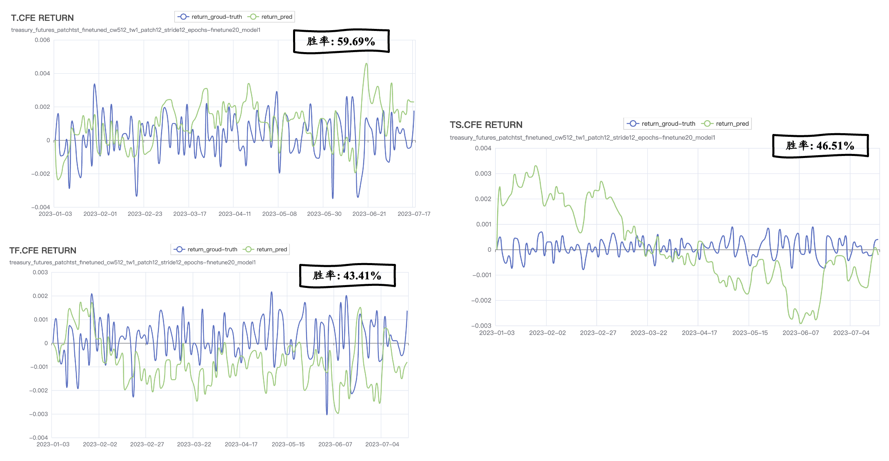

<h1 style="text-align: center;">PatchTST策略</h1>

     更新时间：2023年7月23日  

# 1 Introduction

## 1.1 Background

​		ChatGPT的问世标志着Transformer[^1]架构在深度学习领域核心地位的确立，同时也标志着预训练—微调（Pretrain&Finetune）模型训练范式的形成。近年来，Transformer广泛应用于各个领域，如计算机视觉领域ViT[^2]、语音识别领域Hubert[^3]等，自然也不用说自然语言处理领域的各种大模型[^4]。

​		在时间序列预测领域，Transformer在近年来也大放光彩，其已被证实在时序预测任务上的表现远超过传统时序模型如ARIMA、基于LSTM的时序模型[^5]。就在去年，一系列基于Transformer的时序预测模型被提出，如Informer[^5]、FEDformer[^6]、Autoformer[^7]、LogTrans[^8]、Pyraformer[^9]等等。然而这些研究一味的追求模型的复杂度和特定时序数据集的精确度而忽略了时序模型原本的特性，即学习时序数据中的规律性，在Zeng[^10]的这篇文章中，作者质疑了基于Transformer的一系列模型并通过实验做了一个简单的MLP模型验证了上述模型达到准确率的本质是过拟合。

## 1.2 Model

​		在今年的ICLR会议上，IBM提出PatchTST[^11]模型（**Patch** **T**ime **S**eries **T**ransformer）正面回应了对基于Transformer的时序模型的质疑。PatchTST模型的架构如下图所示，**其模型架构和核心思想都非常简单**：

 + 基于Transfomer的Encoder部分对时间序列数据进行**自监督学习**(基于masked autoencoder思想，充分发挥**Transformer强大的特征学习能力**)，并将预训练好的模型在下游任务进行**微调**。
 + 时序数据Patching预处理。此前无论是基于LSTM的模型还是基于Transformer的模型，都无法避免随着输入模型时序长度(look back winodw)的增加而导致模型训练耗时的问题，因此**以往的模型输入模型的时序长度一般为16左右，其无法学习时序数据长期依赖**，而Patching则完美的解决了这个问题。
 + 金融时序数据天然具有分布偏移特征（distribution shift），导致其预测难度相当大。而PatchTST为了应对这个挑战，提出**通道独立性方法**，从而降低模型过拟合的风险增强模型的鲁棒性，除此之外作者也运用了**逆标准化操作**。

     PatchTST模型结构图  

## 1.3 Hyperparmater

​		PatchTST可调节的超参数如下图所示，其中重点调节参数用红框标出。

     PatchTST超参数

# 2 Result

​		以模型训练损失、收盘价预测和收益率预测来观察模型训练效果。

​		首先对数据集进行说明：

+ 训练集：各期限国债期货上市时间—2022年之间
+ 验证集：2022年全年
+ 测试集：2023年1月1日—2023年7月17日

## 2.1 Loss

​		PatchTST预训练阶段损失函数为masked mse，微调阶段为testset mse。

     PatchTST训练损失

​		由损失情况观察可知：

+ 微调可以快速降低损失，提高模型预测准确率
+ 十年期国债期货(T)和五年期国债期货(TF)模型损失情况正常，**两年期国债期货（TS）明显过拟合**
+ 结论：不同期限国债期货模型需要分别调参

## 2.2 Close price

     PatchTST预测收盘价

​		根据模型预测收盘价情况：

+ 十年期国债期货（T）预测效果较好
+ 五年期国债期货（TF）预测收盘价明显一直在真实价格之下
+ 两年期国债期货（TS）预测效果差
+ 结论同上

## 2.3 Return ratio

     PatchTST预测收益率

​		根据预测胜率来看，表现效果同上述指标，**由于国债期货收益率变化太小，极大地增大了模型预测难度，因此有没有方法可以放大收益率变化，使得模型更好的学习？**

# 3 Strategy

​		国债期货回测设置为：

+ 初始资金均为一千万
+ 十年期、五年期、两年期国债期货**保证金率**分别为2%、1%、0.5%
+ 十年期、五年期、两年期国债期货**合约系数**分别为：10000、10000、20000
+ **手续费率**均为万二

## 3.1 MACD双均线策略：

## 3.2 PatchTST策略：

​		基于PatchTST的国债期货策略回测具体方法如下图所示：

策略回测方法

## 3.3 策略对比		

​		以MACD双均线策略为基准策略，PatchTST策略表现如下：

|                      | MACD双均线策略       | PatchTST策略          |
| -------------------- | -------------------- | --------------------- |
| 十年期国债期货（T）  | 期末资金：9952649.15 | 期末资金：10273624.00 |
| 五年期国债期货（TF） | 期末资金：9985764.26 | 期末资金：9985885.77  |
| 两年期国债期货（TS） | 期末资金：9942626.60 | 期末资金：9993940.62  |

​		接下来以**十年期国债期货**为例展示Backtrader回测绩效分析：

#### 参考文献		

[^1]:Vaswani A, Shazeer N, Parmar N, et al. Attention is all you need[J]. Advances in neural information processing systems, 2017, 30.
[^2]:Dosovitskiy A, Beyer L, Kolesnikov A, et al. An image is worth 16x16 words: Transformers for image recognition at scale[J]. arXiv preprint arXiv:2010.11929, 2020.
[^3]:Hsu W N, Bolte B, Tsai Y H H, et al. Hubert: Self-supervised speech representation learning by masked prediction of hidden units[J]. IEEE/ACM Transactions on Audio, Speech, and Language Processing, 2021, 29: 3451-3460.
[^4]:Brown T, Mann B, Ryder N, et al. Language models are few-shot learners[J]. Advances in neural information processing systems, 2020, 33: 1877-1901.
[^5]:Zhou H, Zhang S, Peng J, et al. Informer: Beyond efficient transformer for long sequence time-series forecasting[C]//Proceedings of the AAAI conference on artificial intelligence. 2021, 35(12): 11106-11115.
[^6]:Zhou T, Ma Z, Wen Q, et al. Fedformer: Frequency enhanced decomposed transformer for long-term series forecasting[C]//International Conference on Machine Learning. PMLR, 2022: 27268-27286.
[^7]:Jiehui Xu, Jianmin Wang, Mingsheng Long, et al. Autoformer: Decomposition transformers with autocorrelation for long-term series forecasting. Advances in Neural Information Processing Systems, 34, 2021. 1, 2, 3, 4, 5, 9
[^8]:Li S, Jin X, Xuan Y, et al. Enhancing the locality and breaking the memory bottleneck of transformer on time series forecasting[J]. Advances in neural information processing systems, 2019, 32.
[^9]:Liu S, Yu H, Liao C, et al. Pyraformer: Low-complexity pyramidal attention for long-range time series modeling and forecasting[C]//International conference on learning representations. 2021.
[^10]:Zeng A, Chen M, Zhang L, et al. Are transformers effective for time series forecasting?[J]. arXiv preprint arXiv:2205.13504, 2022.
[^11]:Nie Y, Nguyen N H, Sinthong P, et al. A Time Series is Worth 64 Words: Long-term Forecasting with Transformers[J]. arXiv preprint arXiv:2211.14730, 2022.

