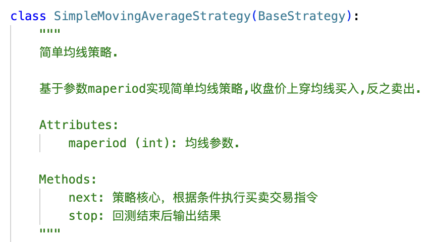
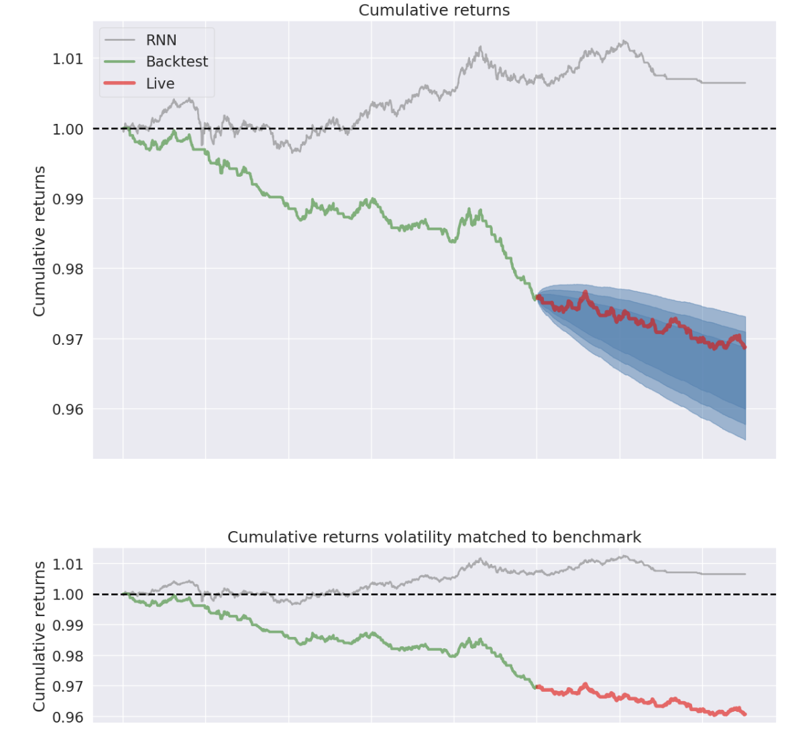

<h1 style="text-align: center;">量化多因子框架</h1>

<div style="text-align: right; font-size: 14px; color: #666;">     更新时间：2024年4月10日  </div>

## 1 Introduction

​		本框架为基于Alphalens(因子分析模块)、Pytorch(深度学习模块)、Backtrader(回测分析模块)、Pyfolio(可视化模块)构建的全流程系统化的量化多因子框架。功能包含五个模块和十个流程。<span style="background-color: yellow;">（*<u>后续增加框架用户交互前后端模块</u>*）</span>


### 1.1 Architecture

​		本框架的项目文件组织结构为：

```python
    ├── data_module/            # 数据模块文件夹
    │   ├── data_pre_process.py       		# 数据预处理
    │   ├── data_loader.py           		# 数据集构建
    │   └── ...
    ├── datasets/               # 数据集文件夹
    │   ├── treasury_futures/     # 国债期货数据文件夹
    │   │   ├── T.CFE_dataset_day.csv  	# 十年期国债期货日频数据
    │   │   └── ... 
    │   └── ...        
    ├── logs/                   # 日志文件夹
    │   ├── treasury_futures/     # 国债期货日志文件夹
    │		│   ├── output_T.CFE.txt         		# 十年期国债期货日志文件
    │		│   └── ...   
    │   └── ... 
    ├── models/                 # 模型文件夹
 		│   ├── rnn/     							# 简单RNN模型
    │		│   ├── rnn.py         							# 简单RNN模型
    │		│   ├── rnn_learner.py         			# RNN学习器
    │   │		└── ... 
    │   └── ...   
    ├── run/                 # pipeline文件夹
    │   ├── treasury_futures.py    # 国债期货pipeline
    │   └── ... 
    ├── save_models/           	# 保存模型文件夹
    │   ├── rnn/     							# 简单RNN模型
    │		│   ├── rnn_T.CFE.pth         			# 十年期国债期货简单RNN模型
    │		│   └── ...
    │   └── ... 
    ├── strategies/            	# 策略文件夹
    │   ├── treasury_futures/     # 国债期货策略文件夹
    │   │   ├── SimpleMovingAverageStrategy.py     # 简单均线策略
    │   │   ├── RNNStrategy.py     								 # 简单RNN策略
    │   │   └── ...
    │   └── ...
    ├── main.py                       # 主函数
    ├── backtest.py                   # 回测模块
    ├── requirements.txt             	# 项目依赖库文件
    ├── README.md                     # 项目说明文件
    └── .gitignore                   	# Git忽略文件列表
```

### 1.2 Requirements

​		开发本框架时的依赖及其版本为：

+ conda 22.9.0
+ python 3.10.6
+ numpy 1.23.4
+ pandas 1.52
+ alphalens 0.4.0
+ pytorch 1.13.0
+ backtrader 1.9.78.123
+ pyfolio 0.9.2

### 1.3 Schedule

| 模块           | 流程              | 进度                                                         | 备注          |
| -------------- | ----------------- | ------------------------------------------------------------ | ------------- |
| 1.数据模块     | 1.1数据获取与处理 | 基于wind完成python版国债期货日频与高频主连数据✅<br />时序交叉验证数据预处理♋️<br />各种数据来源的数据格式是否需要统一？ | ⚠️尚未核对数据 |
| 2.因子分析模块 | 2.1单因子构建     | 基于量价数据构建单因子❓                                      | 需思考方法🤔   |
|                | 2.2单因子检验     | 单因子各项指标检验♋️                                          | 7.17-19完成   |
|                | 2.3因子筛选       | 筛选有效因子♋️                                                | 筛选标准是啥❓ |
| 3.深度学习模块 | 3.1因子合成       | 多因子合成                                                   |               |
|                | 3.2搭建模型       | PatchTST♋️                                                    | 持续研究💪     |
|                | 3.3预测/信号      | 模型集成到策略中实时预测或产生信号✅                          |               |
| 4.回测分析模块 | 4.1构建策略       | 多空策略、仓位管理 📖❓                                        | 持续研究💪     |
|                | 4.2回测分析       | 策略绩效可视化分析✅                                          |               |
| 5.实盘模块     | 5.1交易系统       |                                                              | future...🤷    |
|                | 5.2实盘监控       |                                                              | future...     |
| 6.用户交互模块 |                   |                                                              | future...     |

<div style="text-align: right; font-size: 14px; color: #666;">     ✅已完成  ♋️进行中  ❓有问题  </div>

## 2 Config

​		本框架系统配置参数主要包括**投资品种配置**<span style="background-color: yellow;">（*<u>后续增加各种类别资产</u>*）</span>、 **深度学习模型参数配置**、**回测参数配置**，main函数配置如下：


​		主函数运行方法：

```python
python main.py --invest='treasury_futures' --model_name='rnn' --model_type='classify' 
							 	--window_size=16 --look_ahead=1000 --input_size=7 --hidden_size=32 
  						 	--batch_size=32 --num_epochs=20 --dropout_rate=0.2 --learning_rate=0.001 
								--loss_function='cross_entropy' --num_layers=1 --num_classes=2 
      					--strategy_name='rnn' --startcash=100000 --stake=100 --commission=0.001 --printlog=False 
        				--do_train=True --do_test=True --do_backtest=True
```


## 3 Pipeline

### 3.1 国债期货

​		国债期货pipeline封装在run_feature函数中，目前主要包括六个步骤：

+ <span style="background-color: yellow;"> <u>*step0. 因子分析与筛选模块（该部分尚未完善）*</u></span>

- step1. 读取每个投资标的（不同期限国债期货）数据（调用**get_future_data_csv函数**）
- step2. 构建模型训练数据集（调用**create_datasets_classify**函数）<span style="background-color: yellow;">*<u>后续根据不同模型类别构建不同数据集，需加入回归模型数据集函数并封装为统一的数据集模块</u>*</span>
- step3. 模型训练配置
- step4. 模型训练（调用**train**函数）
- setp5. 模型预测（调用**test**函数）
- step6. 执行回测（调用**backtest**函数）


## 4 Dataset

​		根据不同模型需要构建不同数据集。<span style="background-color: yellow;">目前仅构建标准数据集，后续需要增加时序交叉验证数据集构建</span>。

### 4.1 Classify

​		为分类模型构建分类数据集，包括训练集、验证集、测试集，**数据标签为分类类别**<span style="background-color: yellow;">目前仅构建二分类标签，后续需要根据多空策略的实现构建多分类标签</span>。


## 5 Model

​		基于pytorch实现各种深度学习模型构建。

### 5.1 简单RNN模型


## 6 Train & Test

​		深度学习模型模型与测试。<span style="background-color: yellow;">目前模型的训练方法较为简单，后续需要增加ealy stop以及adjust learning rate部分</span>。


​		模型的训练预测完成以后，保存模型以供后续策略使用。

## 7 Strategy

### 7.1 模版策略


### 7.2 简单均线策略



### 7.3 简单RNN策略


## 8 Backtest

​		回测分析封装在backtest函数中，目前主要包括六个步骤：

+ step1. Load back test data ⚠️ **回测部分读取的数据为原始（因子）数据**
+ step2. Create a cerebro entity
+ step3. Add data to cerebro （调用封装的PandasDataPlus类实现自定义数据读取）
+ step4. Add strategy to cerebro （根据策略选取不同策略类，详见第6节 Strategy）
+ setp5. Add analyzer to cerebro (use pyfolio) （使用pyfolio实现回测分析部分<span style="background-color: yellow;">目前基于pyfolio的可视化需要在jupyter notebook中实现，后续考虑使用其他可视化包</span>）
+ step6. Add config to cerebro <span style="background-color: yellow;">目前仅仅实现非常简单的订单交易，后续需要完善动态仓位管理</span>
+ step7. Run over everything
+ step8. Plot the result


​		backtrader完成策略执行后返回result（❓这是啥数据类型），回测分析交给可视化模块。

## 9 Visulization

​		回测绩效可视化部分基于pyfolio实现。


## Appendix A Example

​		以简单均线策略和简单RNN策略（策略实现见第6节 Strategy）展示目前实现效果。

⚠️**Tips:**

1. 回测设置为：初始资金十万，每手交易100（❓什么单位），手续费率千一，滑点率0.1%。
2. RNN模型为分类模型，模型预测上涨转化为买入信号；反之卖出。

### A 1 回测全览


​		以十年期国债期货为例：

1. 简单20日均线策略初始十万资金，回测期间2015年3月20日到2023年7月10日，期末资金93184.98.

2. 简单RNN策略初始十万资金，回测期间2016年1月1日到2023年7月10日，期末资金100674.41.

   **结论**：

   + 简单RNN模型易过拟合，不易拿全样本进行训练，上述仅用2021年一年的数据进行模型训练，2022年验证，2023年测试，分类准确率依次为：51.1%、55.9%、40.3%。**模型分类效果差且泛化能力低**
   + 在2016-2023年回测情况来看，模型仅有效处理2021年部分数据（<span style="background-color: yellow;">**仅该部分区间有交易，其余区间模型均预测为0（2021年以前），1（2022年以后）**</span>）

### A 2 订单交易细节

​		再次强调⚠️，2020年以前模型均预测为0，因此仅在回测期第一天买入。


​	交易过多，不全部展示。

### A 3 简单均线模型超参数搜索


### A 4 回测绩效分析

​		该部分以简单RNN收益为基准收益，分析简单均线策略回测绩效。

#### A 4.1 量化回测基本统计指标


#### A 4.2 最大回撤率与持续时间


#### A 4.3 收益率可视化




#### A 4.4 持仓及杠杠可视化

​		下面的这些图看不懂😖


<div style="text-align: center; font-size: 14px; color: #666;">     &copy; 2023 Hongjie Xia, Fudan University.  </div>
